[[_TOC_]]

## Why Should We Do This?
Plugins are an old system, and have a lot of flaws as a result. The Listener system was created to replace the Plugins, and address its flaws.

Some of the reasons to replace plugins with listeners include:
- Better performance
- Better memory usage
- Easier to use
- Cleaner code
- Less bugs

## Great, So How Can I Help?
The best practice for converting plugins to listeners is to do it at the same time as fixing bugs or updating that area of the code. For example, say we had a Plugin that handled using a frog on a stick. One day, we need to go back and add a quest requirement check to that interaction. I would first convert the plugin to a listener, and then add the new check in. Two things at once!

## Step-By-Step Example
In the below example, we will be converting the ShooAwayStrayDogPlugin to a Listener, and I'm going to walk you through it step by step. 

The Plugin + A Small Breakdown

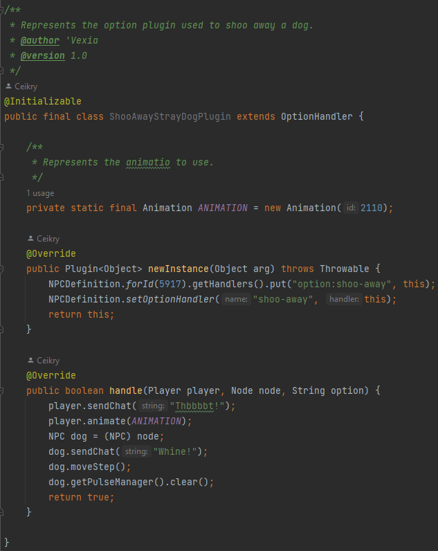

- The `@Initializable` annotation you see is what Plugins require to be loaded by the server - **_Listeners do not require this._**
- The `newInstance` method is where Plugins register the ID/option they are for.
- The `handle` method is what is executed when the interaction is ran.

### Step 1: Creating the Kotlin File
As all new content in the codebase has to be Kotlin, this applies to converted plugins as well. So our first step will be creating the Kotlin file where our new listener will reside. 

In this example, the Plugin we are converting is located at `Server/src/main/java/core/game/interaction/npc`. 

Our Kotlin file, then, will be placed at `Server/src/main/kotlin/rs09/game/interaction/npc`. 

How To Create a Kotlin File

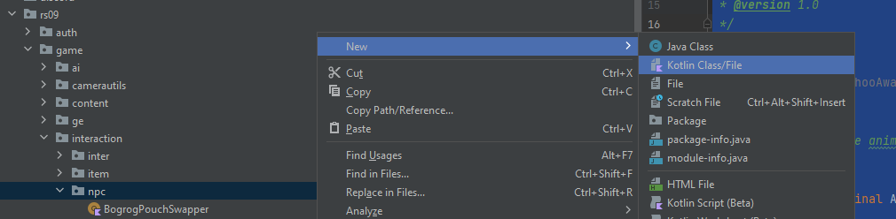

### Step 2: Defining the Class
This step is pretty important, as you need to make sure you do this right so the server can load the file and the compiler knows what your code is supposed to do. 

We are going to create a new class, named `ShooDogListener`, that _implements_ the InteractionListener interface, which provides us with the `defineListeners()` and listener definition methods. 

In Kotlin, the way you state that a class *implements* an interface or *extends* another class is with `:`. 

How It Should Look

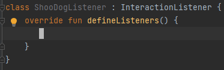

### Step 3: Outlining The Listener
#### Finding the Information
At this point we need to figure out what type of interaction, what IDs, and what options (if any) we are handling. Since we are converting a Plugin to a Listener, this information should (hopefully) already be available to us. 

In Plugins, these details are provided in the `newInstance` method, which is where we will look:

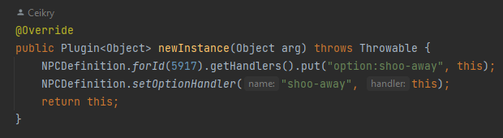

We can see it's registering itself for the `shoo-away` option of `NPC 5917`. 

In this Plugin, there was actually a mistake made. You can see it's registering itself both:
- Specifically for `shoo-away` on NPC 5917
- Generally for all NPCs for `shoo-away`

As you can imagine, this duplicate information is actually **useless.**

#### How To Use The Information
Now, we are going to take this information and use it to outline our listener. 

We know the following things about this plugin:
- It's handling an NPC interaction
- It's handling the "shoo-away" option for ALL NPCs.

So, we are going to translate this information to the outline for our listener:

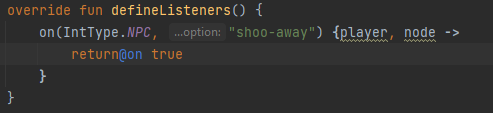

**_Note: For more information on the structure of listeners, check [here](Writing-Listeners)_**

### Step 4: The Interaction Code
Now we need to translate the actual code that performs the game actions for the interaction. 

Surprisingly, for conversions, this is actually the **easy part!**

In Plugins, this code is usually placed in the `handle` method: 

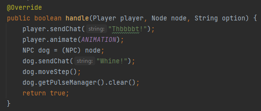

And we can just take that code (excluding the `return true;` line) and just.... move it over!

Select the code inside the handle method:

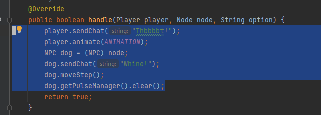

And literally just copy this, and paste it into the inside of the listener's `{ }`:

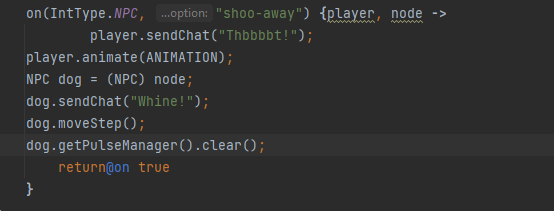

Now, when you do this, you'll get a prompt from IntelliJ to convert Java to Kotlin:

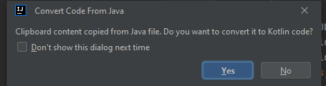

Click "Yes", and let it do its thing:

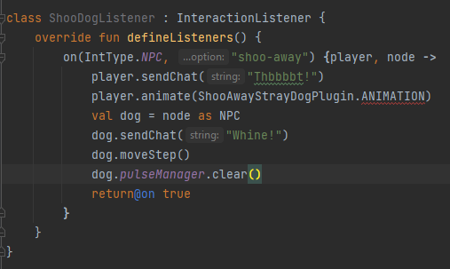

Uh oh! We have a red line! 

That's because the Plugin had defined a class-local variable for holding an ANIMATION:

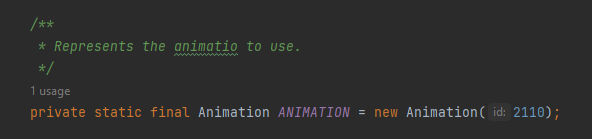

All we have to do is just move that over:

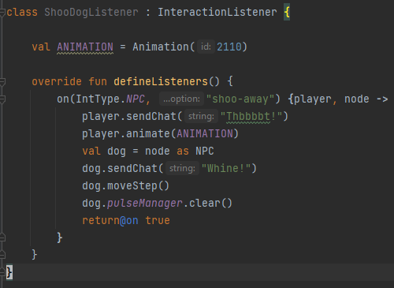

### Step 5: Cleanup
We're almost done, now we just need to clean things up!

First thing's first, we're going to replace as many of the lines as we can with [ContentAPI](ContentAPI) equivalents:

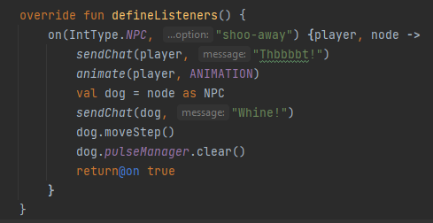

Now some other cleanup just to make it look nicer:

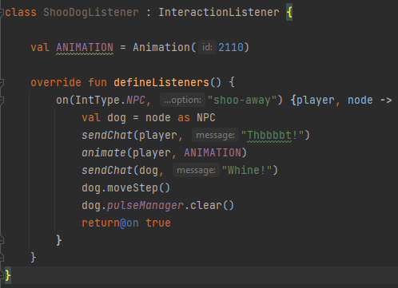

And last but **_definitely not least_**, make sure to delete the old Plugin!

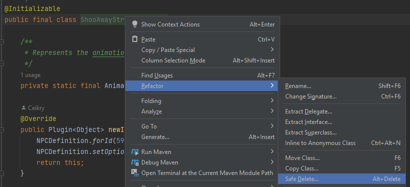

### Step 6: The Results
Now you get to sit back and admire your work! 

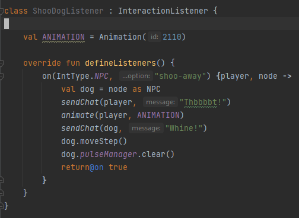

Namely, our new Listener is only 24 lines of code, including imports, while the old Plugin is a whopping **44 lines of code!** We almost halved the amount of screen space required to look at our work! It might not seem like much with such a simple example, but this definitely adds up with larger and more complex files. 

Additionally, you have helped reduce the amount of outdated legacy code left floating around in the project, and **_every bit helps!_**

## Recommendations
Learning to convert on its own is an excellent step, but you're way better off fully understanding the structure of Listeners.

I highly recommend everyone to read over my guide for [Writing Listeners](Writing-Listeners), as it goes into more detail about the structure.