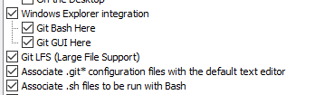
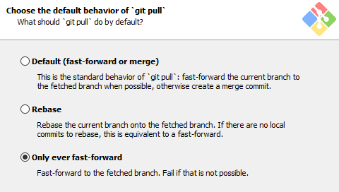
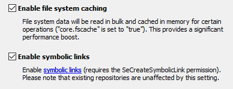
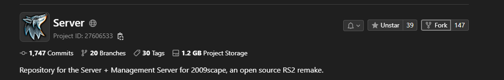
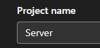
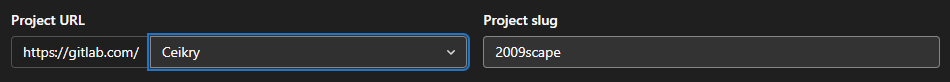
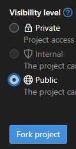
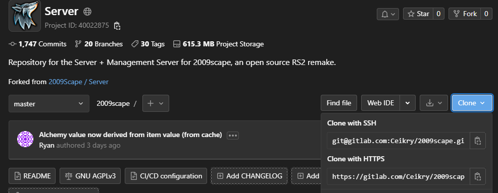
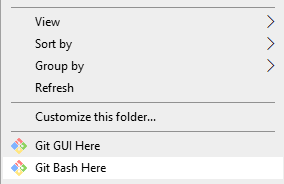

[[_TOC_]]

## Installing Git & Git LFS
### Linux
Get it from your package manager, e.g: 
```
$ sudo apt install git git-lfs
```
### Windows
Download and install Git from the [official website.](https://gitforwindows.org/index.html).

**In the installer, you should make sure to select the below options:**

<details>
<summary>Click to view options</summary>






</details>

## Fork this project
On the [homepage](https://gitlab.com/2009scape/2009scape) for this repository, click the fork button in the top right:


Now, name it whatever you like, e.g. leave the default of "Server" or call it "09 Dev", whatever you want really:



Now, in the project URL "Select a namespace" dropdown, select your gitlab username, which in my case is Ceikry:



The **Project Slug** portion is what the url slug of your fork will be. E.g. since mine is 2009scape, my fork will be at gitlab.com/Ceikry/2009scape. If it was bababooey, the url would be gitlab.com/Ceikry/bababooey

**Make sure to set the visibility level to public and click Fork Project:**



This forking process will take a while, but once it's done you'll be taken to your new fork of the project.

## Clone the Project
Now that you have your own fork, you can get your fork cloned and set up locally!

First, we need to get the link to **your fork.** On the page for your fork, e.g. gitlab.com/You/2009scape, click the "Clone" button, and copy the link provided in the "**Clone with SSH**" box:



### Linux
Open up a terminal and cd to the directory you want the files to live in, and issue the `git clone <url>` command, where <url> is the link you copied from before.

### Windows
Open up Explorer and navigate to the directory you want the files to live in. Right click in the folder, and select "Git Bash Here"



Now, in the command window that opens, type `git clone ` then right click and paste the url you copied above, then hit enter. This will clone the repository into a new folder in the location you chose.

## Adding 2009scape as your upstream
In the command/terminal window you have open, `cd` into the folder containing the cloned repo. If your repo is named `2009scape`, then you will `cd 2009scape`

Now you want to issue the command `git remote add upstream https://gitlab.com/2009scape/2009scape`

This will add an `upstream` remote reference to your git so that you can interact directly with the main 2009scape repository.

## Creating Merge Requests
Merge Requests are how you get your changes into the main 2009scape repository. To create a merge request, go to the **page for your fork**, click the Merge Requests button on the left side of the screen, and then click the New Merge Request button in the top right. 

For the source branch on the left, select the branch that your changes exist in. On the right, make sure 2009scape/2009scape is the selected repository, and master is the selected branch. Now click Compare Branches and Continue, and fill out the Merge Request template provided to you.

## Best Practices: Branches
Before you start making changes, **never make changes on the default branch, aka master.**
You should always create a branch for each feature you add/bug you fix, etc.
You can create a new branch using `git checkout -b branchname`, and you can move between branches using `git checkout branchname` (note the lack of -b)

## Best Practices: Updating Your Fork
Updating your fork doesn't have to be painful, in fact assuming you follow the best practices for branches outline above, it's super easy! With a command(Git Bash)/terminal window opened up to your 2009scape folder, just do:
```
$ git checkout master
$ git fetch -ap upstream
$ git pull --ff-only upstream master
$ git push origin
```
And just that easily, your fork is completely up to date! 
Now, the next thing you should do is ***rebase*** your branches.
Let's say you had a branch open for cider, called `cider`. 
Simply do:
```
$ git rebase master cider
$ git push --force origin
```
And now your `cider` branch is updated onto the changes present in the updated master branch.

## Best Practices: Undoing an accidental merge
At some point you probably will accidentally merge the main repo into your branch. 
You will need to undo this; we cannot accept MRs that have a merge as a commit.
The sooner you fix it the better.

Let's say you have accidentally merged changes from the main repo into a branch caller `cider` on your fork.
Here's how you can undo it:

0) If you are worried you may lose some work copy the files somewhere else. 
In theory you should not lose anything but if you do not feel confident with git copy your changes elsewhere.

1) Roll your branch back to before you merged (ideally just one commit back):
```
git reset --hard HEAD~1
```

or

```
git reset --hard {commit hash}
```

2) Force push this rollback to *your* repo/branch (`cider` in this example)

```
git push --force origin cider
```

3) Follow [Best Practices: Updating Your Fork](Git-Basics.md?ref_type=heads#best-practices-updating-your-fork).

4) If you've lost something you did not backup you can use ```git checkout {hash}``` to try and find the pieces.

## Undoing updating a local master
It's possible at some point you accidently update your master branch. This will cause you problems. Before you do this you will need to temporarly allow [force pushing](https://docs.gitlab.com/ee/user/project/protected_branches.html#allow-force-push-on-a-protected-branch) to your master branch. Make sure to turn it off afterwards.

1) Get the latest upstream files
```
git fetch -ap upstream
```
2) Reset your master branch. **Warning you will lose any locally changed files that are only on master!**
```
git reset --hard upstream/master
```
3) Push to your master branch
```
git push origin master --force
```
