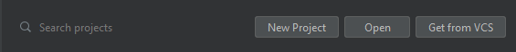
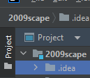
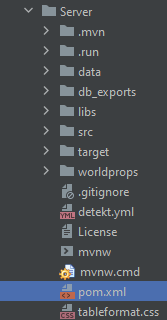
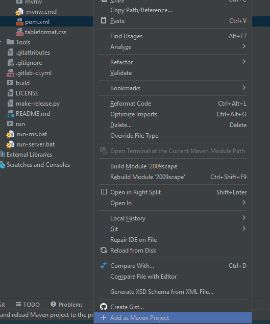
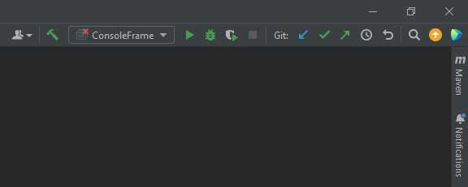
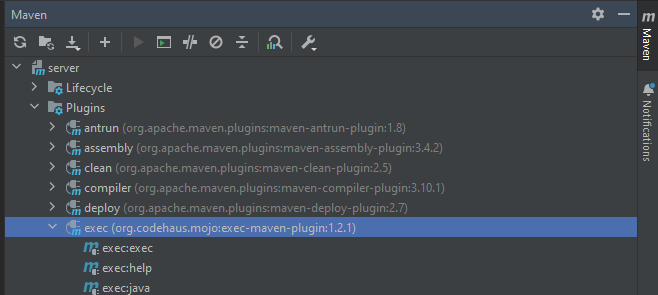
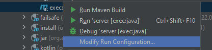
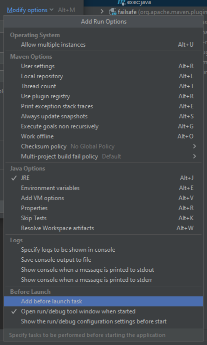
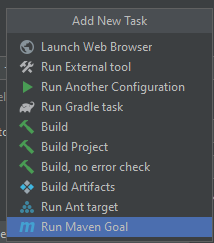
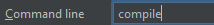

**_Note: This assumes you have followed the [Git tutorial](git-basics)_**

## Initial Setup
#### Once you have IntelliJ installed and open, click the Open button on the top bar:

#### Navigate to the folder you cloned your fork to, select the 2009scape folder, and then click ok on the bottom.

If IntelliJ prompts you to trust the project, say that you trust it and let it finish opening. 

#### Once it has finished opening, find the file browser on the left: 

#### Navigate to the "Server" folder inside the file browser, and locate `pom.xml`: 

#### Right click this, and click `Add as Maven Project`: 

This might take a while, just let it do its thing for a moment.

#### Now select the Maven tab on the top right corner of the screen:

#### Expand the server -> Plugins -> exec tabs:

#### Right click the `exec:java` task, and click `Modify Run Configuration`:

#### Click modify options, and then click `Add before launch task`

#### Select `Run Maven Goal`

#### Put `compile` in the Command Line section, and press Ok

#### Now click apply, and then ok

#### Now you can select the run configuration in the top right, and press the green play button to build and run the project: 

